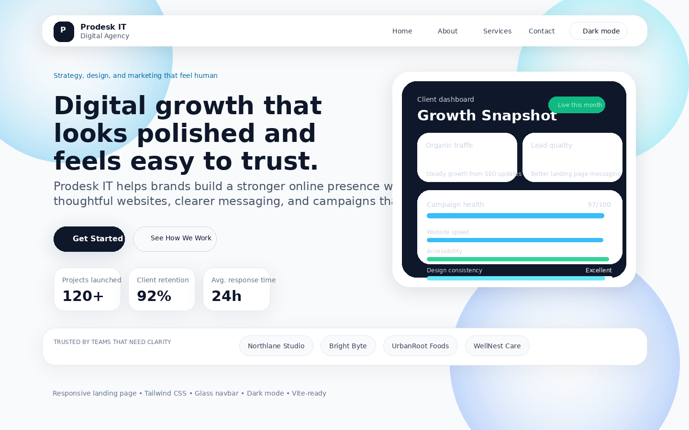

# Prodesk IT Digital Agency

Week 1 internship project for **Prodesk IT**.

This is a responsive landing page for a fictional digital agency. I built it using **Vite**, **Tailwind CSS**, and **vanilla JavaScript** for the Level 3 requirement.

## Project Overview
The goal was to create a landing page that looks professional on both desktop and mobile while also including the extra Level 3 features:
- sticky navbar
- dark mode toggle
- hover micro-interactions
- glassmorphism effect on the navbar
- responsive layout using Tailwind CSS

## Live Demo
Add your deployed link here after hosting the project:

**Live URL:** `https://your-live-link-here`

## Screenshot


## Tech Stack
- HTML5
- Tailwind CSS
- JavaScript
- Vite

## Folder Structure
```bash
prodesk-it-digital-agency/
├── .github/
│   └── workflows/
│       └── ci.yml
├── public/
│   └── favicon.svg
├── src/
│   ├── main.js
│   ├── site.js
│   └── styles.css
├── .gitignore
├── index.html
├── package.json
├── Prompts.md
├── README.md
└── vite.config.js
```

## Features
- Responsive navbar with mobile menu
- Hero section with CTA buttons
- About section
- Services section with 3 service cards
- Sticky frosted glass navbar
- Dark mode toggle with saved theme preference
- Button and card hover effects
- Footer with social icons
- Semantic structure and focus styles for accessibility

## Setup
### Install dependencies
```bash
npm install
```

### Start development server
```bash
npm run dev
```

### Build for production
```bash
npm run build
```

### Preview production build
```bash
npm run preview
```

## Deployment
This project can be deployed easily on **Vercel** or **Netlify**.

### Vercel
1. Push the project to GitHub
2. Import the repository in Vercel
3. Deploy with default settings

### Netlify
1. Push the project to GitHub
2. Import the repository in Netlify
3. Use `npm run build` as the build command
4. Use `dist` as the publish directory

## Lighthouse Check
Before submitting, run Lighthouse in Chrome DevTools and check:
- Performance
- Accessibility
- Best Practices
- SEO

I kept the project lightweight and used semantic HTML, focus states, and high-contrast colors to help with the score.

## Submission Notes
This repo includes:
- source code
- README.md
- Prompts.md
- screenshot preview

## Author
**Naman Harjai**
